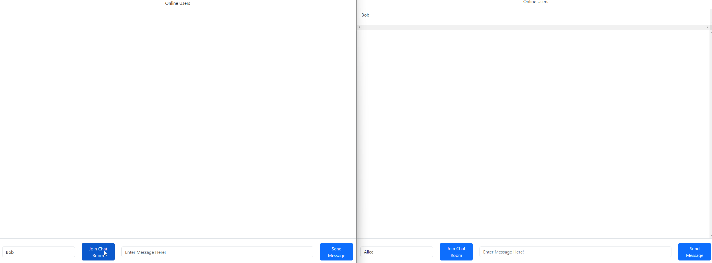

# EbChat

Simple single page webchat application that I made with [socket.io](https://socket.io/)

The chat room can contain fifteen users at a time. Users will be disconnected for inactivity every fifteen minutes and only users who have joined the chat room can view the messages. I built the frontend using html / css with bootstrap styling. On the backend I'm using node.js with socket.io for most of the functionality as well as node-cache to store recently sent messages.

To run the application make sure you have npm and node.js installed on your machine.

You can then install the dependincies using the command

*npm install*

and run the application on localhost at port 3000 using

*node index.js*

Improvments to make

- [x] Add caching for recently sent messages 
- [ ] Add multiple chat rooms
- [ ] Deploy on heroku

